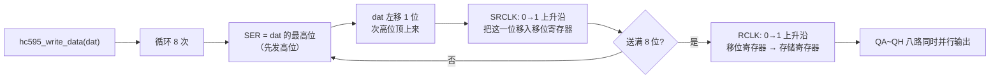
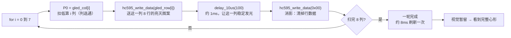

# 课程笔记｜51单片机｜LED点阵实验（实验11~13）

## 课程信息

| 项目 | 内容 |
|---|---|
| 日期 | 2026-09-29 |
| 课程/章节 | 普中51开发攻略 LED点阵实验章节（实验11~13） |
| 使用材料 | 攻略 PDF；官方 `11/12/13-LED点阵实验/main.c`；本人工程 `桌面\普中51单片机\Keil project\LED点阵实验\MAIN.c` |
| 整理范围 | 完整（IO扩展原理 → 74HC595时序 → 扫描原理 → 源码 → 图案解析 → 动手改造） |

> ⚠️ **本篇与前面 6 篇的最大不同**：这是全库第一次接触 **74HC595 串转并芯片**，也是第一次用"扫描 + 消影"驱动**二维阵列**。前面的实验最多管 8 个数码管位，这次要管 **64 个 LED**。

---

## 一、核心结论

1. **74HC595 的作用是"省 IO"**：单片机只出 3 根线（`SER`/`SRCLK`/`RCLK`），就能换来 8 根并行输出线。本实验用它驱动点阵的 **8 行**。
2. **8×8 点阵 = 64 个 LED，靠扫描驱动**：同一时刻只点亮 1 列，8 列轮流刷新，靠视觉暂留"合成"完整图案。
3. **分工**：列选通由 **P0 直连**（低电平有效，`gled_col[i]` 每次只拉低 1 位）；行数据由 **74HC595** 并行输出（`gled_row[i]` 的 8 个 bit 对应 8 行，1=亮）。
4. **必须消影**：每列显示完要 `hc595_write_data(0x00)` 清掉行数据，否则切列瞬间会看到上一列的残影 —— 和动态数码管同一套路。
5. **硬件前提**：点阵旁的 **J24 黄色跳线帽必须短接到 GND 一端**，否则点阵整块不亮（官方代码注释原话）。
6. 用 11 根 IO（P0 八根 + P3.4/P3.5/P3.6）控制了 64 个 LED；若直接驱动需要 64 根 IO。

---

## 二、知识结构

### 2.1 74HC595 写入时序



### 2.2 主循环扫描



---

## 三、详细笔记

### 3.1 为什么要 74HC595：IO 不够用了

8×8 点阵有 8 行 + 8 列 = 16 根控制线。如果还想接数码管、按键、传感器，IO 很快就见底。

74HC595 的思路是**串转并**：用 3 根线，把 8 位数据**一位一位地"串"进去**，最后一次性从 8 根线并行吐出来。

| 方案 | 占用 IO | 说明 |
|---|---|---|
| 直接驱动 8 根行线 | 8 根 | 最直观，最费 IO |
| **74HC595 串转并** | **3 根**（SER/SRCLK/RCLK） | 本实验方案，省 5 根 |

### 3.2 74HC595 内部结构：为什么要两个时钟

595 内部有两级寄存器，这是理解它的关键：

```
        SER (串行数据 P3.4)
         │
         ▼
   ┌───────────────┐  SRCLK (移位时钟 P3.6)      上升沿移入 1 bit
   │  移位寄存器    │ ◄───────────────────────
   │  (8 位)       │
   └───────┬───────┘
           │  RCLK (存储时钟 P3.5) 上升沿：整体搬过去
           ▼
   ┌───────────────┐
   │  存储寄存器    │  ← 也叫"锁存器"
   │  (8 位)       │
   └───────┬───────┘
           ▼
     QA QB QC QD QE QF QG QH   → 接点阵的 8 行
```

- **移位寄存器**：`SRCLK` 每来一个上升沿，就把 `SER` 上当前的电平移进 1 位，原有的 8 位整体挪一格。
- **存储寄存器**：只有 `RCLK` 上升沿才把移位寄存器的内容**整体复制**过去，驱动 QA~QH 输出。

> 💡 **为什么要两级？** 如果只有一级，8 位数据一位一位移进去的过程中，输出端会跟着一位一位地变，点阵上会看到"数据流动"的闪烁。有了锁存器，**送数据的过程输出不变，送完才一起更新** —— 这是 595 的精华。

### 3.3 源码逐行解读

> 📁 本人工程：`桌面\普中51单片机\Keil project\LED点阵实验\MAIN.c`（**与官方 `13-LED点阵实验(显示图像)/main.c` 逐行一致，尚未做个人改动**）

```c
#include "reg51.h"                  // 注意：本工程用 reg51.h，其余工程多用 REGX52.H

typedef unsigned int u16;
typedef unsigned char u8;

// ===== 74HC595 三根控制线 =====
sbit SRCLK=P3^6;                    // 移位寄存器时钟：上升沿移入 1 位
sbit RCLK =P3^5;                    // 存储寄存器时钟：上升沿并行输出
sbit SER  =P3^4;                    // 串行数据输入

#define LEDDZ_COL_PORT  P0          // 列选端口：直连 P0，不经 595

// ===== 图案数据 =====
u8 gled_row[8]={0x38,0x7C,0x7E,0x3F,0x3F,0x7E,0x7C,0x38};  // 每列 8 行的亮灭
u8 gled_col[8]={0x7f,0xbf,0xdf,0xef,0xf7,0xfb,0xfd,0xfe};  // 逐列拉低（选中第 0~7 列）

// 约 10us 延时，ten_us=1 → 约 10us
void delay_10us(u16 ten_us)
{
    while(ten_us--);
}

// ===== 核心函数：向 595 写入一个字节 =====
void hc595_write_data(u8 dat)
{
    u8 i=0;
    for(i=0;i<8;i++)                // 8 位，一位一位地送
    {
        SER = dat>>7;               // ① 取最高位放到串行数据线（先发高位）
        dat <<= 1;                  // ② 左移，把次高位顶到最高位，等下一位
        SRCLK=0;
        delay_10us(1);
        SRCLK=1;                    // ③ 上升沿：把 SER 上的这一位移入移位寄存器
        delay_10us(1);
    }
    RCLK=1;
    delay_10us(1);
    RCLK=0;                         // ④ 上升沿：移位寄存器 → 存储寄存器 → QA~QH 输出
}

void main()
{
    u8 i=0;
    while(1)
    {
        for(i=0;i<8;i++)            // 扫 8 列
        {
            LEDDZ_COL_PORT  = gled_col[i];      // ① 列选：拉低第 i 列
            hc595_write_data(gled_row[i]);      // ② 行数据：这一列 8 行谁亮
            delay_10us(100);                    // ③ 延时约 1ms，稳定显示
            hc595_write_data(0x00);             // ④ 消影：清行数据
        }
    }
}
```

**注意 `SER = dat>>7` 这一句**：`dat` 是 `unsigned char`，`dat>>7` 的结果只可能是 0 或 1，正好赋给 `sbit`（位变量）。如果写成 `SER = dat` 就错了 —— 那等于把整个字节赋给 1 bit。

### 3.4 心形图案是怎么算出来的（重点）

这段数据看着像天书，其实**拆成二进制就一目了然**。

`gled_col[i]` 负责"选第几列" —— 8 个值每次都只有一个 bit 是 0：

| i | 值 | 二进制 | 拉低的是哪一位 |
|:-:|:--|:--|:--|
| 0 | `0x7f` | `0111 1111` | bit7 |
| 1 | `0xbf` | `1011 1111` | bit6 |
| 2 | `0xdf` | `1101 1111` | bit5 |
| 3 | `0xef` | `1110 1111` | bit4 |
| 4 | `0xf7` | `1111 0111` | bit3 |
| 5 | `0xfb` | `1111 1011` | bit2 |
| 6 | `0xfd` | `1111 1101` | bit1 |
| 7 | `0xfe` | `1111 1110` | bit0 |

`gled_row[i]` 负责"这一列 8 行谁亮"。**因为先发高位**，所以 bit7 → 顶行，bit0 → 底行。

把 8 个值都展开（`1` = 亮）：

| i | `gled_row[i]` | 二进制（bit7→bit0） |
|:-:|:--|:--|
| 0 | `0x38` | `0 0 1 1 1 0 0 0` |
| 1 | `0x7C` | `0 1 1 1 1 1 0 0` |
| 2 | `0x7E` | `0 1 1 1 1 1 1 0` |
| 3 | `0x3F` | `0 0 1 1 1 1 1 1` |
| 4 | `0x3F` | `0 0 1 1 1 1 1 1` |
| 5 | `0x7E` | `0 1 1 1 1 1 1 0` |
| 6 | `0x7C` | `0 1 1 1 1 1 0 0` |
| 7 | `0x38` | `0 0 1 1 1 0 0 0` |

8 列横向拼起来：

```
       列0 列1 列2 列3 列4 列5 列6 列7
行0:    .   .   .   .   .   .   .   .
行1:    .   █   █   .   .   █   █   .
行2:    █   █   █   █   █   █   █   █
行3:    █   █   █   █   █   █   █   █
行4:    █   █   █   █   █   █   █   █
行5:    .   █   █   █   █   █   █   .
行6:    .   .   █   █   █   █   .   .
行7:    .   .   .   █   █   .   .   .
```

**一个心形** —— 上面两瓣，下面收尖。官方注释"实验现象：显示心形"由此而来。

> ✅ **改图案的方法**：想显示别的，只要把 `gled_row[8]` 换成新的 8 个字节。具体做法见第四节。

### 3.5 消影为什么重要

```c
hc595_write_data(gled_row[i]);   // 送这一列的行数据
delay_10us(100);                 // 稳定显示约 1ms
hc595_write_data(0x00);          // ← 关键：全部清 0
```

如果不加最后这一句：循环进入下一轮，`P0` 换了列选通，但**上一列的行数据还留在 595 的存储寄存器里**。新列亮起的瞬间会显示上一列的图案 → 出现"残影/拖影"。

这和动态数码管的 `SMG_A_DP_PORT=0x00` 是**完全同一个套路**，只是被清的从"段码"变成了"行数据"。

### 3.6 和动态数码管对照着看（同构关系）

这两个实验本质是**同一套扫描思想**，只是换了扩展芯片：

| 维度 | 动态数码管（实验7） | LED点阵（实验11~13） |
|:--|:--|:--|
| 显示单元 | 8 位 × 7 段 | 8 × 8 = 64 个 LED |
| "显示什么" | 段码，P0 直连 | 行数据，**74HC595** 输出 |
| "选哪一个" | 位选，**74HC138** 译码（3 根线 → 8 路） | 列选，P0 直连（8 根线） |
| 扩展芯片原理 | **译码**：3 位输入 → 8 路中**只有 1 路**有效 | **串转并**：8 位数据 → 8 路**任意组合**同时输出 |
| 消影 | 段码送 `0x00` | 行数据送 `0x00` |
| 视觉暂留 | 每位 < 24ms | 每列约 1ms，一轮约 8ms |

> 🔑 **74HC138 和 74HC595 都能"3 根线换 8 根线"，但完全不同**：
> - **138 是译码器** —— 输出**互斥**，同一时刻只有一个有效，适合"选一个"（位选）。
> - **595 是移位寄存器** —— 输出**可任意**，8 个位想怎么组合都行，适合"送数据"（行图案）。
>
> 一个负责"选在哪"，一个负责"显示什么"，各司其职。

---

## 四、例题、案例或实验

### 4.1 官方三个递进实验

E 盘 `4--实验程序/1--基础实验/` 下有三个点阵实验，建议按顺序看：

| 实验 | 目录 | 现象 | 学到什么 |
|:--|:--|:--|:--|
| 实验11 | `11-LED点阵实验(点亮一个点)` | 只亮一个点 | 最小可用模型，先跑通 595 |
| 实验12 | `12-LED点阵实验(显示数字)` | 显示一个数字 | 行数据如何组成字符 |
| 实验13 | `13-LED点阵实验(显示图像)` | **显示心形** | ← 你抄的就是这个 |

另有 `10-IO扩展(串转并)实验-74HC595`，代码更简单（只要 595 输出，不扫描列），是理解 595 的最好入口 —— 它让 595 逐个输出 `0x01,0x02,0x04...`，点阵上表现为一行灯光左右滚动。

### 4.2 动手改造任务（强烈建议做）

你的工程目前**和官方一字不差**，等于还没真正"吃"下这个实验。建议按下面顺序改：

**任务 1：点阵上显示"自己的图案"**

1. 在纸上画一个 8×8 的格子，涂出你想要的形状（笑脸 / 字母 / 箭头都行）
2. 每一列从上到下读 8 格，亮记 `1`、灭记 `0`，凑成 8 位二进制
3. 转成十六进制，填进 `gled_row[8]`
4. 烧录验证

> 提示：算的时候别忘了 **bit7 是最上面一行**。

**任务 2：让图案动起来**

在 `main` 的 `while(1)` 里加一层循环：

```c
while(1)
{
    for(i=0;i<8;i++)
    {
        // ...原来的扫描代码...
    }
    hc595_write_data(0x00);      // 扫完一整屏先清屏
    delay_10us(50000);           // 停留一段时间，避免人眼只看到残影
}
```

调整 `delay_10us` 的参数，观察图案是"稳定显示"还是"闪一下"。

**任务 3：让心形跳动**

把 `gled_row[8]` 每次扫描前改写（比如整体右移一位），实现"图案平移"效果。

**任务 4：对比 595 与 138**

把 `10-IO扩展实验` 和 `7-动态数码管实验` 的代码摆在一起看，回答：为什么这两个实验都用 3 根线控制 8 路，但代码写法完全不同？

---

## 五、术语、公式或关键表达

- **串转并（串行转并行）**：数据一位一位串行送入，最终从多根线并行输出
- **移位寄存器**：每个时钟上升沿移入 1 bit，原数据整体挪一位
- **存储寄存器 / 锁存器**：把移位结果整体锁存后输出，避免送数过程中输出乱跳
- **上升沿有效**：`SRCLK`、`RCLK` 都是 **0→1** 的那一刻触发
- **先发高位**：`SER = dat>>7`，所以数组元素的 **bit7 对应点阵最上一行**
- **列选通**：P0 每次只拉低 1 位，选中 1 列（共阴极，低电平有效）
- **扫描**：逐列轮流点亮，靠视觉暂留合成整幅图案
- **消影**：切列前清空行数据，防止上一列残影
- **J24 跳线帽**：点阵模块的电源跳线，必须短接到 **GND** 一端

---

## 六、课堂任务与 DDL

- [ ] 完成 4.2 的四个动手任务（无硬性截止日期）
- [ ] 把本工程从"照抄官方"改成"自己的版本"（至少换掉图案数据）
- [ ] 硬件确认：点阵旁 J24 跳线帽是否已短接到 GND

---

## 七、待核对与疑问

| 问题 | 原因 | 相关来源 | 建议核对方式 |
|---|---|---|---|
| 攻略 PDF 具体章节号与页码 | 本笔记未能定位到对应页 | 攻略 PDF | 翻阅 PDF 点阵章节后补页码 |
| `gled_row` 的 bit7 是否真对应最上一行 | 由"先发高位"+ QA→QH 接行序推断，未查原理图 | `hc595_write_data` 代码逻辑 | 写一个只亮 bit7 的数据 `0x80` 烧录，看点阵哪一行亮 |
| 列扫描方向：i=0 是最左列还是最右列 | 取决于 PCB 布线 | `gled_col` 从 bit7 递减到 bit0 | 让只有 `i=0` 输出行数据，看哪一列亮 |
| 74HC595 的 OE（输出使能）脚接法 | 本实验代码未控制该脚 | 74HC595 芯片手册 | 对照工程原理图 |
| 头文件不一致：本工程 `reg51.h`，其余工程 `REGX52.H` | 官方例程历史遗留 | [[工具库]] 头文件对比表 | 统一为 `REGX52.H` 后编译验证 |
| 点阵配图缺失 | `images/` 已有 7 张图（蜂鸣器/数码管/按键/板子总览等），但**暂无 74HC595 内部结构与点阵电路图** | 攻略 PDF；`images/` 现有内容 | 从攻略 PDF 截图后存 `images/led_matrix_circuit.png` |

---

## 八、复习与主动回忆

### 10–20 分钟复习清单

1. 讲清楚 74HC595 为什么能"3 根线换 8 根线"
2. 说出 `SRCLK` 和 `RCLK` 各自的作用（为什么需要两个时钟）
3. 默写 `hc595_write_data` 的 4 步
4. 说出主循环扫描的 4 步：列选 → 行数据 → 延时 → 消影
5. 解释 `gled_col` 的 8 个值有什么规律

### 主动回忆题

1. 595 内部为什么要有移位寄存器和存储寄存器两级？只留一级会怎样？
2. `SER = dat>>7` 为什么不能写成 `SER = dat`？
3. `gled_row[i]` 和 `gled_col[i]` 各自负责什么？哪个走 595、哪个走 P0？
4. 去掉 `hc595_write_data(0x00)` 会出现什么现象？
5. 74HC138 和 74HC595 都是"3 根换 8 根"，本质区别是什么？
6. 8 列全扫一遍大约多久？为什么这个时间必须够短？

### 答案要点

1. 两级是为了**送数据时输出不跳变**；只有一级的话，8 位一位位移入的过程中输出会跟着逐步变化，点阵上会看到闪烁/拖影。
2. `SER` 是 `sbit`（1 位），`dat` 是 8 位；直接赋值会丢掉 7 位。`dat>>7` 把最高位挤到最低位，结果只会是 0 或 1。
3. `gled_row[i]` 是"这一列 8 行的亮灭"，走 **74HC595**；`gled_col[i]` 是"选第几列"，走 **P0 直连**。
4. 切换列时上一列的行数据残留 → 出现拖影/残影。
5. 138 的输出**互斥**（同一时刻只有一路有效），适合"选一个"；595 的输出**可任意组合**，适合"送数据"。
6. 每列 `delay_10us(100)` ≈ 1ms，8 列约 8ms；必须小于人眼视觉暂留阈值（约 24ms），否则会看出闪烁。

---

*素材来源：《普中51单片机开发攻略_V1.3》LED点阵章节；`E:\学习资料\4--实验程序\1--基础实验\10/11/12/13-*`；本人工程 `桌面\普中51单片机\Keil project\LED点阵实验\MAIN.c`。*
