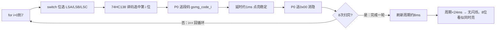
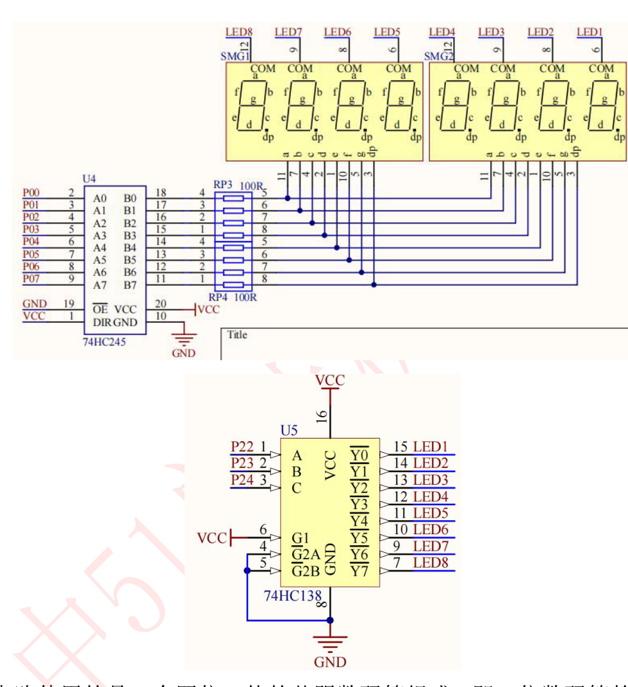

# 课程笔记｜51单片机｜动态数码管实验（实验7）

## 课程信息

| 项目 | 内容 |
|---|---|
| 日期 | 2026-09-27 |
| 课程/章节 | 普中51开发攻略 第12章（动态数码管实验） |
| 使用材料 | 攻略 PDF 第12章；7-动态数码管实验/main.c |
| 整理范围 | 完整（动态显示原理 → 74HC245/74HC138 → 源码 → 动手） |

## 一、核心结论

1. **动态显示原理 = 视觉暂留**：8 位数码管轮流点亮（每次只亮 1 位），每位的点亮间隔 < **24ms**，人眼就"看"不到闪烁，以为 8 位同时亮。[教材 攻略 p.141]
2. 段选（显示什么）由 **P0 → 74HC245** 驱动；位选（亮哪一位）由 **P2.2/P2.3/P2.4 → 74HC138** 译码控制，3 根线管 8 位，**节省 IO**。[教材 攻略 p.145]
3. 74HC138 是 3-8 译码器：输入 A2A1A0 的二进制值 N，就选中 **YN（低电平有效）**；如 111→Y7、000→Y0。[教材 攻略 p.144]
4. 显示函数套路：**位选 → 送段码 → 延时 → 消隐**，循环 8 次完成一轮刷新。[教材 攻略 p.147]
5. **消隐（送 0x00）**是防止"拖影"的关键：切换位选前先清掉段码，避免前一位的残影。[教材 攻略 p.148]

## 二、知识结构



## 三、详细笔记

### 3.1 为什么需要"动态"显示

开发板是 2 个四位一体共阴数码管拼成 8 位，但**段选线全部并联**（a~dp 共用一根总线）。如果 8 位同时显示不同数字，段选线冲突——只能"同时亮一样的"。

动态显示解法：**同一时刻只点亮 1 位**，显示它的数字，然后立刻切到下一位……只要 8 位轮流刷新的周期足够快（<24ms/位），人眼视觉暂留就把它们"合成"成同时点亮。[教材 攻略 p.141]

### 3.2 74HC245 与 74HC138：为什么要这两颗芯片

**74HC245（八路收发器，三态输出）**：P0 驱动能力不足，用它增强输出。DIR 置高时数据从 A 端传到 B 端，单向驱动段选线。[教材 攻略 p.143]

**74HC138（3-8 译码器）**：8 根位选线如果让单片机直接控制要占 8 个 IO；用 138 只要 **3 根输入线（A0/A1/A2）**，译码出 8 路输出。[教材 攻略 p.142/144]

| 输入 A2 A1 A0（即 P2.4 P2.3 P2.2） | 选中输出 | 说明 |
|---|---|---|
| 1 1 1 | Y7（低） | 数值 7 |
| 1 1 0 | Y6（低） | 数值 6 |
| … | … | … |
| 0 0 0 | Y0（低） | 数值 0 |

> 注意：138 输出是**低电平有效**，对应共阴数码管"位选低电平导通"。

硬件电路（截图自攻略 p.145，与静态数码管同一电路）：



*图：动态数码管电路 —— 左图 74HC245+排阻驱动段选（P0→a~dp）；右图 74HC138 位选（P2.2/2.3/2.4→A/B/C→Y0~Y7→LED1~8）*

### 3.3 源码逐行解读

```c
#include "reg52.h"
typedef unsigned int u16;
typedef unsigned char u8;
#define SMG_A_DP_PORT P0            // 段码端口 = P0

sbit LSA=P2^2;                      // 位选第0位输入（A0）
sbit LSB=P2^3;                      // 位选第1位输入（A1）
sbit LSC=P2^4;                      // 位选第2位输入（A2）

u8 gsmg_code[17]={0x3f,0x06,...};   // 共阴段码表 0~F

void delay_10us(u16 ten_us)         // 延时（约10us/次）
{
    while(ten_us--);
}

void smg_display(void)              // 动态显示函数
{
    u8 i=0;
    for(i=0;i<8;i++)                // 扫 8 位
    {
        switch(i)                   // ① 位选：选第 i 位（i 对应 A2A1A0）
        {
            case 0: LSC=1;LSB=1;LSA=1;break;   // 111→Y7→最左(SMG1)
            case 1: LSC=1;LSB=1;LSA=0;break;   // 110→Y6
            case 2: LSC=1;LSB=0;LSA=1;break;
            case 3: LSC=1;LSB=0;LSA=0;break;
            case 4: LSC=0;LSB=1;LSA=1;break;
            case 5: LSC=0;LSB=1;LSA=0;break;
            case 6: LSC=0;LSB=0;LSA=1;break;
            case 7: LSC=0;LSB=0;LSA=0;break;   // 000→Y0→最右
        }
        SMG_A_DP_PORT=gsmg_code[i]; // ② 段选：送第 i 位要显示的数字
        delay_10us(100);            // ③ 延时约1ms：让这一位稳定点亮
        SMG_A_DP_PORT=0x00;         // ④ 消隐：清段码，防止下一位拖影
    }
}

void main()
{
    while(1)
    {
        smg_display();              // 不断刷新，8位轮流点亮
    }
}
```

**执行流程**：i=0 选中 Y7（最左）显示"0" → 延时 → 消隐 → i=1 显示"1"…… 8 次后一轮完成，再从头开始。现象 = 从左到右显示 **01234567**。

### 3.4 消隐为什么重要

如果不加 `SMG_A_DP_PORT=0x00`：切换位选瞬间，段码还没来得及更新，旧位选上的旧段码会被看到 → 出现"残影/拖影"（本应熄灭的位置短暂发亮）。[教材 攻略 p.148]

> 三个可改参数：`i<8` 改显示位数；`gsmg_code[i]` 的下标改显示内容；`delay_10us(100)` 改刷新速度（太大→闪烁，太小→亮度降低）。

### 3.5 我的实现：用定时器中断重构扫描（本实验的最大升级）

> 📁 本人工程：`桌面\普中51单片机\Keil project\数码管\动态数码管显示\main.c`（代码日期：2026-09-24）

这一版和官方例程已经是**两种架构**了：

| 维度 | 官方 `7-动态数码管实验` | 你的实现 |
|:--|:--|:--|
| 扫描在哪跑 | `main` 的 `while(1)` 里 | **Timer0 中断**，每约 1ms 自动切一位 |
| 位选写法 | 8 分支 `switch(i)` | `P2 = (P2 & 0xE3) \| ((7-pos) << 2)` |
| 显示内容 | 直接查 `gsmg_code[i]` | **`SMG_Buf[8]` 显示缓冲区** |
| 段码表 | 16 项（0~F） | 18 项（+ `'-'` = 0x40、全灭 = 0x00） |
| 主循环 | 被 `delay_10us(100)` 阻塞 | **完全空闲** |

#### 升级点 1：把刷新从主循环搬进中断

官方的 `smg_display()` 里有 `delay_10us(100)`，意味着**整个主循环被数码管刷新绑架**——将来想加按键扫描、串口收发，任何一个耗时操作都会让数码管闪烁。

你的做法是让**定时器每约 1ms 自动进一次中断**刷一位，主循环彻底空出来。这是嵌入式里非常经典的**分层思想**：刷新是"后台任务"，业务逻辑跑在 `while(1)` 里，两者互不干扰。

```c
void Timer0_Init(void) {
    TMOD = 0x01;                // 定时器0，方式1（16位定时）
    TH0 = (65536 - 1000) / 256; // 定时初值（高 8 位）
    TL0 = (65536 - 1000) % 256; // 定时初值（低 8 位）
    EA  = 1;                    // 开总中断
    ET0 = 1;                    // 开定时器0中断
    TR0 = 1;                    // 启动定时器0
}
```

#### 升级点 2：`SMG_Buf` 显示缓冲区

想显示什么，只改 `SMG_Buf[]` 这个数组；刷新的事交给中断。`main` 里写缓冲区，`Timer0_ISR` 读缓冲区——**读写分离**。这是显示驱动的标准分层做法，后面做时钟、计数器时价值会立刻体现出来。

#### 升级点 3：`P2 & 0xE3` 顺手保护了蜂鸣器

```c
P2 = (P2 & 0xE3) | ((7 - pos) << 2);
```

- `0xE3` = `1110 0011` → 先把 **bit4/3/2**（正是 74HC138 的地址线 A2/A1/A0）清零
- `((7-pos) << 2)` → 把位号搬到 bit4/3/2 上
- `7-pos` 是**倒序映射**：`pos=0` → `111` → Y7（最左），和官方 `switch` 的对应关系完全一致

关键在 `& 0xE3` **保留了 bit5**。回顾 [[静态数码管#3.6 我的实现：把段码表"写成能看懂的样子"|静态数码管 §3.6]] 提到的：**P2.5 接的是蜂鸣器**（也是 LED D6）。如果用 `P2 = ...` 整字节赋值而不做掩码，就可能把 P2.5 一起改掉 → **数码管扫描的同时蜂鸣器跟着响**。

官方用 `sbit LSC=P2^4` 逐位赋值不会有这个问题；一旦你改用整字节操作，**这个掩码就从"可选"变成了"必须"**。你这一步做对了。

**需要留意**：

1. **定时初值与晶振对不上**：代码注释写「以12MHz晶振计」，但普中A2 的晶振是 **11.0592MHz**（见项目 README）。`65536-1000` 在 11.0592MHz 下实际定时约 **1085us**，不是 1000us。
   - 影响：8 位刷新周期 ≈ 8.68ms，仍远小于 24ms 的视觉暂留阈值，**显示完全正常**
   - 建议：要么把注释改成"以 11.0592MHz 晶振计"，要么把初值改成 `65536-922`（922 ≈ 1000 × 11.0592/12）
2. **`SMG_Display()` 是死代码**：定义了但没被调用。可以删掉，也可以留着当"单独点亮某一位"的调试工具（若保留，建议注释里写明用途）。
3. **你还没学到定时器就先用了它**：`TMOD` / `EA` / `ET0` / `TR0` 的作用会在第 2 期「定时器」章节系统展开。先记住一句话：**`TMOD=0x01` 选定时器0方式1，`TR0=1` 让它跑起来，计数溢出时自动跳到 `interrupt 1`**。

## 四、例题、案例或实验

**动手任务：验证动态显示原理**

1. 打开 `E:\学习资料\4--实验程序\1--基础实验\7-动态数码管实验` 工程
2. 把 `delay_10us(100)` 改成 `delay_10us(5000)` → 烧录后能看到 8 位**逐个点亮又熄灭**（间隔超过 24ms 就露馅了）→ 改回 100
3. 把 `for(i=0;i<8;i++)` 改成 `i<4` → 只显示前 4 位"0123"
4. 把 `gsmg_code[i]` 改成 `gsmg_code[7-i]` → 显示 "76543210"（从右到左）
5. 删掉 `SMG_A_DP_PORT=0x00;` 这一行 → 观察拖影现象

**预期现象**：下载程序后"数码管模块"从左到右显示 01234567。[教材 攻略 p.148]

## 五、术语、公式或关键表达

- **动态显示 / 扫描显示**：逐位轮流点亮，靠视觉暂留合成
- **视觉暂留**：人眼分辨变化的最小间隔约 **24ms**
- **位选 / 段选**：选哪一位 / 显示什么
- **消隐**：切位前清段码防拖影
- **74HC138 译码**：A2A1A0 二进制值 N → YN 低电平
- **刷新率**：一轮扫描 8 位所需时间，每位 <24ms

## 六、课堂任务与 DDL

- 完成第四节动手任务 1~5（无硬性截止日期）
- 挑战项：把 8 位都显示"8"（段码 0x7F），观察效果

## 七、待核对与疑问

| 问题 | 原因 | 相关来源 | 建议核对方式 |
|---|---|---|---|
| case 0 对应 SMG1 还是最右位 | 取决于 PCB 位选布线 | 攻略 p.148 现象"01234567" | 板子上实测确认方向 |
| delay_10us(100) 实际是否 <24ms | 编译优化影响 | 攻略 p.141（24ms）/p.148（延时） | KEIL 仿真测一轮耗时 |
| 74HC245 DIR 固定接法 | 硬件已固定 A→B | 攻略 p.143 | 对照原理图 |
| 定时初值 `65536-1000` 与 11.0592MHz 晶振的偏差 | 注释按 12MHz 写，实际晶振是 11.0592MHz | 本人工程 `Timer0_Init` 注释 | 改用 `65536-922` 后对比刷新速度，或用示波器实测 |

## 八、复习与主动回忆

### 10–20 分钟复习清单

1. 复述动态显示的完整原理（为什么能同时亮）
2. 说出 74HC138 的输入输出关系
3. 默写 smg_display 的 4 步：位选 → 段码 → 延时 → 消隐
4. 解释消隐的作用

### 主动回忆题

1. 为什么 8 位数码管不能直接同时显示不同数字？
2. 动态刷新每位间隔不能超过多少？超了会怎样？
3. 74HC138 输入 A2A1A0=101 时选通哪个输出？
4. 把延时调大会出现什么现象？调小呢？
5. 删掉消隐语句会产生什么问题？

### 答案要点

1. 段选线全并联，同一时刻所有位收到的段码相同；只能靠轮流点亮实现不同数字。[教材 攻略 p.141]
2. 24ms；超过会看到闪烁/逐个点亮熄灭。[教材 攻略 p.141]
3. 101 二进制=5 → Y5（低电平）。[教材 攻略 p.144]
4. 调大→闪烁（刷新慢）；调小→可能亮度变暗/拖影（点亮时间太短）。
5. 切换位选瞬间旧段码残留 → 出现拖影残影。[教材 攻略 p.148]

---
*素材来源：《普中51单片机开发攻略_V1.3》第12章；E:\学习资料\4--实验程序\1--基础实验\7-动态数码管实验\main.c。*
