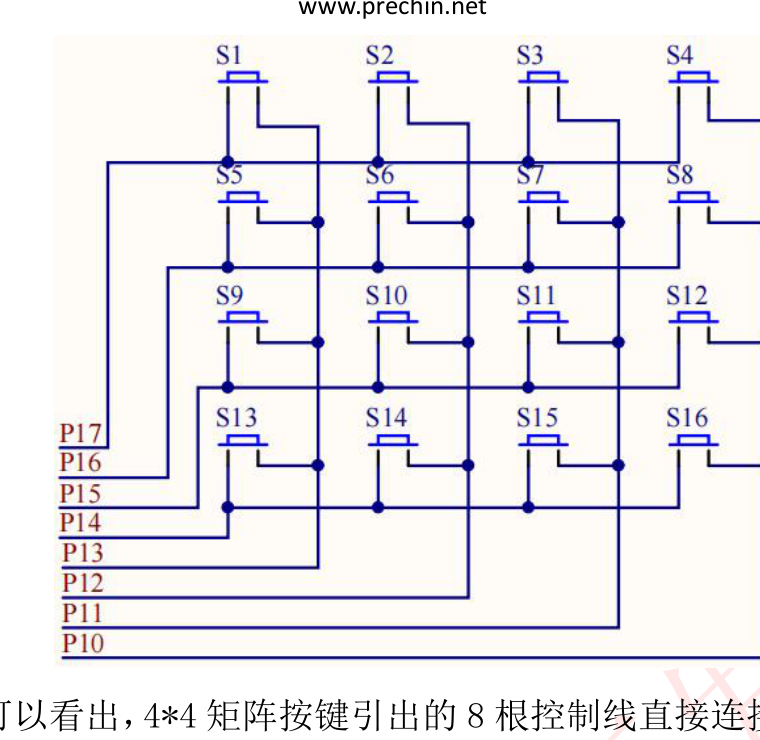

# 课程笔记｜51单片机｜矩阵按键实验（实验9）

## 课程信息

| 项目 | 内容 |
|---|---|
| 日期 | 2026-09-27 |
| 课程/章节 | 普中51开发攻略 第14章（矩阵按键实验） |
| 使用材料 | 攻略 PDF 第14章；9-矩阵按键实验/main.c |
| 整理范围 | 完整（矩阵原理 → 行列扫描 → 线翻转 → 源码 → 动手） |

## 一、核心结论

1. **矩阵按键用 8 根线控制 16 个按键**（4行×4列），比独立按键省一半 IO；按键按行、列交叉排列。[教材 攻略 p.157]
2. 电路接法：矩阵按键 8 根控制线接 **P1 口**，**P1.7=第1行、P1.3=第1列**（行线 P1.4~P1.7，列线 P1.0~P1.3）。[教材 攻略 p.159]
3. 检测原理：让**一列输出 0**，读回端口看**哪一行变 0**（被按键拉低），行列交叉点 = 按下的键。[教材 攻略 p.158]
4. 两种扫描法：**行列扫描**（4 组逐列置 0 + switch 匹配，官方 main 用的这个）与**线翻转法**（先列后行，代码更短）。[教材 攻略 p.158/162]
5. 键值到显示：`key_matrix_ranks_scan()` 返回 1~16（对应 S1~S16），显示时用 `gsmg_code[key-1]` 映射到 0~F。[教材 攻略 p.163]

## 二、知识结构

```mermaid
flowchart LR
    A[4x4按键矩阵] --> B[8线接P1]
    B --> C[行列扫描:逐列置0]
    C --> D[读端口找变0的行]
    D --> E[行列交叉=按键]
    E --> F[返回键值1-16]
    F --> G[gsmg_code[key-1]]
    G --> H[数码管显示0-F]
```

## 三、详细笔记

### 3.1 为什么要用矩阵按键

独立按键一个键占一个 IO，16 个键要 16 根线。矩阵按键把按键排成**4行×4列**，按键连接在行线和列线的交叉点上，**8 根线就能检测 16 个键**——代价是检测逻辑复杂一点。[教材 攻略 p.157]

硬件电路（截图自攻略 p.159，S1~S16 与 P1 口连接）：



*图：4×4 矩阵按键电路 —— S1~S16 排列，行线 P1.7~P1.4，列线 P1.3~P1.0*

### 3.2 检测原理：一列置 0，看哪行变 0

矩阵按键所有键的**一端接行线、一端接列线**。按键未按时，行/列互不相通；按下时，行和列被短接。[教材 攻略 p.158]

以"第 1 列置 0"为例：`KEY_MATRIX_PORT=0xf7`（=1111 0111，只有 P1.3 是 0）后，第 1 列的键如果被按下，对应**行线被拉成 0**。读回端口值：

| 读回值 | 哪一行变0 | 对应按键 |
|---|---|---|
| 0x77 (0111 0111) | P1.7（第1行） | S1 |
| 0xb7 (1011 0111) | P1.6（第2行） | S5 |
| 0xd7 (1101 0111) | P1.5（第3行） | S9 |
| 0xe7 (1110 0111) | P1.4（第4行） | S13 |

> 口诀：**置 0 的列 + 读到的行 = 按键位置**。S1~S16 编号规则：第1行 S1~S4、第2行 S5~S8、第3行 S9~S12、第4行 S13~S16，从左到右递增。

### 3.3 行列扫描法（key_matrix_ranks_scan）逐行解读

官方 main 使用的函数，核心是**4 组相同结构的扫描**（每组负责一列）：

```c
u8 key_matrix_ranks_scan(void)
{
    u8 key_value=0;

    KEY_MATRIX_PORT=0xf7;              // 第1列置0（P1.3=0），其余全1
    if(KEY_MATRIX_PORT!=0xf7)          // 值变了 = 第1列有键按下
    {
        delay_10us(1000);              // 软件消抖
        switch(KEY_MATRIX_PORT)        // 看哪一行变0 → 确定是哪个键
        {
            case 0x77: key_value=1;break;   // 行1列1 → S1
            case 0xb7: key_value=5;break;   // 行2列1 → S5
            case 0xd7: key_value=9;break;   // 行3列1 → S9
            case 0xe7: key_value=13;break;  // 行4列1 → S13
        }
    }
    while(KEY_MATRIX_PORT!=0xf7);      // 等待按键松开（松后才继续扫下一列）

    KEY_MATRIX_PORT=0xfb;              // 第2列置0（P1.2=0）→ S2/S6/S10/S14
    if(KEY_MATRIX_PORT!=0xfb){ delay_10us(1000);
        switch(KEY_MATRIX_PORT){
            case 0x7b: key_value=2;break;
            case 0xbb: key_value=6;break;
            case 0xdb: key_value=10;break;
            case 0xeb: key_value=14;break; } }
    while(KEY_MATRIX_PORT!=0xfb);

    KEY_MATRIX_PORT=0xfd;              // 第3列置0（P1.1=0）→ S3/S7/S11/S15
    if(KEY_MATRIX_PORT!=0xfd){ delay_10us(1000);
        switch(KEY_MATRIX_PORT){
            case 0x7d: key_value=3;break;
            case 0xbd: key_value=7;break;
            case 0xdd: key_value=11;break;
            case 0xed: key_value=15;break; } }
    while(KEY_MATRIX_PORT!=0xfd);

    KEY_MATRIX_PORT=0xfe;              // 第4列置0（P1.0=0）→ S4/S8/S12/S16
    if(KEY_MATRIX_PORT!=0xfe){ delay_10us(1000);
        switch(KEY_MATRIX_PORT){
            case 0x7e: key_value=4;break;
            case 0xbe: key_value=8;break;
            case 0xde: key_value=12;break;
            case 0xee: key_value=16;break; } }
    while(KEY_MATRIX_PORT!=0xfe);

    return key_value;                  // 返回0=没按下，1~16=对应S1~S16
}
```

### 3.4 线翻转法（key_matrix_flip_scan）—— 另一种写法

```c
u8 key_matrix_flip_scan(void)
{
    static u8 key_value=0;             // static：值在两次调用间保留

    KEY_MATRIX_PORT=0x0f;              // ① 行输出0（高4位=0），列输入
    if(KEY_MATRIX_PORT!=0x0f)          // 有键按下（某列被拉低）
    {
        delay_10us(1000);              // 消抖
        if(KEY_MATRIX_PORT!=0x0f)
        {
            KEY_MATRIX_PORT=0x0f;      // 重新送一次
            switch(KEY_MATRIX_PORT)    // 读列 → 得到列号(1~4)
            {
                case 0x07: key_value=1;break;   // P1.3被拉低→第1列
                case 0x0b: key_value=2;break;   // P1.2→第2列
                case 0x0d: key_value=3;break;   // P1.1→第3列
                case 0x0e: key_value=4;break;   // P1.0→第4列
            }
            KEY_MATRIX_PORT=0xf0;      // ② 翻转：列输出0，行输入
            switch(KEY_MATRIX_PORT)    // 读行 → 得到行号，叠加到键值
            {
                case 0x70: key_value=key_value+0;break;   // 第1行
                case 0xb0: key_value=key_value+4;break;   // 第2行
                case 0xd0: key_value=key_value+8;break;   // 第3行
                case 0xe0: key_value=key_value+12;break;  // 第4行
            }
            while(KEY_MATRIX_PORT!=0xf0);  // 等松开
        }
    }
    else
        key_value=0;                    // 没按键 → 清0
    return key_value;
}
```

**两种方法对比**：[教材 攻略 p.162]

| 对比 | 行列扫描 | 线翻转 |
|---|---|---|
| 原理 | 逐列置0，switch 匹配完整端口值 | 先测列再测行，两次组合 |
| 代码量 | 较长（4组重复） | 较短 |
| 消抖 | 每列都有 | 一次 |
| 本实验使用 | main 中使用 | 备用学习 |

### 3.5 主函数：键值 → 显示

```c
void main()
{
    u8 key=0;
    while(1)
    {
        key=key_matrix_ranks_scan();     // 读按键
        if(key!=0)                       // 有键按下
            SMG_A_DP_PORT=gsmg_code[key-1]; // 键值-1 → 数组下标0~15 → 显示0~F
    }
}
```

> 键值映射：S1→key=1→下标0→显示"0"；S2→key=2→下标1→显示"1"……S16→key=16→下标15→显示"F"。[教材 攻略 p.163]

## 四、例题、案例或实验

**动手任务：验证矩阵按键**

1. 打开 `E:\学习资料\4--实验程序\1--基础实验\9-矩阵按键实验` 工程
2. 烧录后依次按下 S1~S16，数码管最左位应显示 0~F
3. 改主函数用 `key_matrix_flip_scan()` 替换 `key_matrix_ranks_scan()`，对比两种扫描效果是否一致
4. 挑战：改成"按键按下时数码管显示对应数字，松开后显示'8'（全亮）"——提示：else 分支加 `SMG_A_DP_PORT=gsmg_code[8]`

**预期现象**：下载程序后，按下"矩阵按键"模块 S1~S16 键，对应数码管最左边显示 0~F。[教材 攻略 p.163]

## 五、术语、公式或关键表达

- **矩阵按键**：行×列交叉排列，8线控16键
- **行列扫描**：逐列置0 + 读行变化
- **线翻转法**：先列后行两次读取组合键值
- **消抖**：delay_10us(1000)≈10ms 软件消抖
- **键值映射**：key-1 转段码表下标
- **static 变量**：函数返回后值保留（线翻转法用）

## 六、课堂任务与 DDL

- 完成第四节动手任务 1~3（无硬性截止日期）
- 挑战项：按键松开显示"8"

## 七、待核对与疑问

| 问题 | 原因 | 相关来源 | 建议核对方式 |
|---|---|---|---|
| S1~S16 物理排列与键值对应关系 | 编号依赖 PCB 丝印 | 攻略 p.159 | 板子上实际按 S5 看显示 |
| 线翻转法为何两次都重新赋值端口 | 翻转法需切换输入输出方向 | 攻略 p.162 | 结合 GPIO 输入输出特性理解 |
| 4 组扫描时其他列为何必须保持1 | 避免多列同时置0误判 | 攻略 p.158 | 动手改 0xf7 为 0xf0 观察 |

## 八、复习与主动回忆

### 10–20 分钟复习清单

1. 复述矩阵按键"一列置0看哪行变0"的原理
2. 默写 S1~S16 的行列编号规则
3. 说出行列扫描 vs 线翻转的异同
4. 解释 `gsmg_code[key-1]` 为什么减 1

### 主动回忆题

1. 16 个按键为什么只用 8 根线？独立按键要几根？
2. `KEY_MATRIX_PORT=0xf7` 置 0 的是哪一位？对应哪一列？
3. 0xb7 表示哪个键被按下？为什么？
4. 线翻转法第一步 0x0f 测的是行还是列？
5. 主函数里 key 为 0 时为什么不显示？

### 答案要点

1. 4×4 交叉矩阵，行线+列线共 8 根；独立按键 16 键要 16 根。[教材 攻略 p.157]
2. P1.3 置 0，即第 1 列。[教材 攻略 p.159]
3. 0xb7：P1.6（第2行）被拉低 + 第1列置0 → 第2行第1列 = S5 → key=5。[教材 攻略 p.159]
4. 测列（0x0f 高4位行输出0，读低4位列），得到列号 1~4。[教材 攻略 p.162]
5. key=0 表示没有键按下（或消抖中），不更新显示，保持原值。[教材 攻略 p.163]

---
*素材来源：《普中51单片机开发攻略_V1.3》第14章；E:\学习资料\4--实验程序\1--基础实验\9-矩阵按键实验\main.c。*
