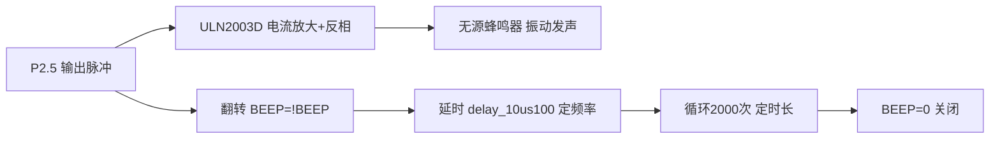
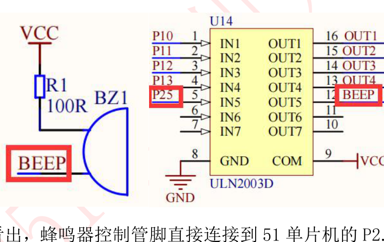

# 课程笔记｜51单片机｜蜂鸣器实验（实验5）

## 课程信息

| 项目 | 内容 |
|---|---|
| 日期 | 2026-09-27 |
| 课程/章节 | 普中51开发攻略 第10章（蜂鸣器实验） |
| 使用材料 | 攻略 PDF 第10章；5-蜂鸣器实验/main.c |
| 整理范围 | 完整（原理 → 硬件 → 源码 → 动手 → 排错） |

## 一、核心结论

1. 蜂鸣器分**有源/无源**：有源内部自带振荡电路，通电就响；无源（开发板用的压电式）必须给 **1.5~5KHz 脉冲信号**才响。 [教材 攻略 p.125]
2. 51 单片机 IO 口驱动能力弱（蜂鸣器需约 30mA），**不能直接驱动**，开发板用 **ULN2003D** 芯片放大电流。[教材 攻略 p.126]
3. 蜂鸣器接 **P2.5**，经 ULN2003 后逻辑像**非门**：P2.5 输出高 → 蜂鸣器端低；P2.5 低 → 蜂鸣器端高。[教材 攻略 p.126]
4. 发声音调 = 改**脉冲频率**（改延时时间）；音量 = 改**占空比**（高电平时间）；发声时长 = 改循环次数 **i**。[教材 攻略 p.127]
5. 源码套路：`while(i--)` 翻转 BEEP 2000 次 → `i=0` → `BEEP=0` 关闭，实现"响一段时间后停"。[教材 攻略 p.127]

## 二、知识结构



## 三、详细笔记

### 3.1 蜂鸣器原理：有源 vs 无源

| 类型 | 内部结构 | 怎么响 | 音调能变吗 |
|---|---|---|---|
| 有源 | 自带振荡电路 | 通电即响 | 一般不能（频率固定） |
| 无源 | 无振荡电路 | 需外部脉冲（1.5~5KHz） | 能（改频率改音调） |

> "有源/无源"指内部**有没有振荡电路**，不是指电源！[教材 攻略 p.125]

开发板用的是**无源压电式**蜂鸣器：给 P2.5 输出高低电平脉冲，压电片周期性振动发声。

### 3.2 为什么不能直接用 IO 驱动

- 51 单片机 IO 口输出能力弱（即使加上拉电阻），蜂鸣器正常工作需约 **30mA** 电流
- 直接驱动会让整个芯片其他 IO 的驱动能力进一步下降甚至无法工作
- 解决：**ULN2003D**（达林顿驱动芯片）把 IO 口的"控制信号"放大成"驱动电流"，IO 口只需提供不到 1mA

硬件电路（截图自攻略 p.126，可对照板子实物）：



*图：蜂鸣器模块电路 —— R1(100Ω)、BZ1(无源蜂鸣器)、U14(ULN2003D)，P2.5 经芯片驱动 BEEP*

> 记住口诀：**51 单片机是用来"控制"的，不是用来"驱动"的。** 大电流外设一律加驱动芯片。[教材 攻略 p.126]

### 3.3 源码逐行解读

```c
#include "reg52.h"                  // 头文件：内含各寄存器定义
typedef unsigned int  u16;          // 类型别名：u16 = unsigned int
typedef unsigned char u8;           // 类型别名：u8 = unsigned char
sbit BEEP=P2^5;                     // 位定义：把 P2.5 引脚命名为 BEEP

void delay_10us(u16 ten_us)         // 延时函数：ten_us=1 时约延时 10us
{
    while(ten_us--);                // 空转耗时间（先用后减）
}

void main()
{
    u16 i=2000;                     // 计数器：决定发声时长
    while(1)                        // 主循环：程序永远不退出
    {
        while(i--)                  // 循环 2000 次（i 从 2000 减到 0）
        {
            BEEP=!BEEP;             // 翻转 P2.5：0→1、1→0，产生脉冲
            delay_10us(100);        // 延时约 1ms：决定脉冲频率（音调）
        }
        i=0;                        // 计数清零
        BEEP=0;                     // 关闭蜂鸣器（停止发声）
    }
}
```

**运行过程拆解**：
1. P2.5 以约 1ms 间隔不断翻转 → 约 500Hz 脉冲 → 蜂鸣器发声
2. 2000 次翻转后 i 减到 0，循环结束
3. `BEEP=0` → 脉冲停止 → 蜂鸣器关闭
4. 再次进入 while(1)，但 i 已为 0，`while(i--)` 不执行，蜂鸣器保持关闭

### 3.4 三个可改参数（改一个看一个现象）

| 改什么 | 怎么改 | 现象 |
|---|---|---|
| 发声时长 | `u16 i=2000` 改成 4000 | 响的时间变长一倍 |
| 音调（频率） | `delay_10us(100)` 改 50 | 频率变快，声音变高 |
| 音量（占空比） | 高电平时间拉长：`BEEP=1; delay_10us(190); BEEP=0;` | 声音变大 |

> 注意：音调频率不能太高或太低（超出 1.5~5KHz 范围可能听不到或无声），音量靠改高电平时间不是改延时总量。[教材 攻略 p.127]

### 3.5 我的实现：从"响一下"到"演奏《稻香》"

> 📁 本人工程：`桌面\普中51单片机\Keil project\蜂鸣器\main.c`（代码日期：2026-09-24）

官方例程只是"响一会儿然后停"，你的版本已经是一个**乐曲播放器**——把蜂鸣器从"会叫的元件"变成了"能定音高的乐器"。

| 维度 | 官方 `5-蜂鸣器实验` | 你的实现 |
|:--|:--|:--|
| 音高怎么来 | `delay_10us(100)` 试出来的固定值 | `250000UL/freq` 按频率反推半周期 |
| 音域 | 只有一个音 | **三个音区、22 个音**（中音/高音/低音） |
| 时长怎么控 | `while(i--)` 数翻转次数 | `freq*ms/1000` 按"要响多少毫秒"反推周期数 |
| 曲谱 | 无 | `Melody[][2]` 二维数组存 `{音名, 节拍}` |

**代码的三层结构**：

```c
unsigned int code Freq[22] = {0,
    262,294,330,349,392,440,494,          /* 中音 1~7 */
    523,587,659,698,784,880,988,          /* 高音 1~7 */
    131,147,165,175,196,220,247 };        /* 低音 1~7 */
```

**第一层 · 频率表**：`Freq[n]` 直接给出第 n 个音名的赫兹数，0 号留给休止符。低音区是你为了《稻香》间奏**额外加出来的**（官方和攻略都没有）。

```c
void PlayFreq(unsigned int freq, unsigned int ms){
    unsigned long cyc = (unsigned long)freq * ms / 1000;
    unsigned int half = 250000UL / freq;
    if(freq == 0){ Delay(500); return; }     // 休止
    while(cyc--){ Beep = ~Beep; Delay(half/10); }
}
```

**第二层 · 发音核心**：整份代码最关键的函数。
- `half = 250000UL/freq`：由频率反推**半周期**——频率越高，半周期越短。所以同一个函数能发出任意音高。
- `cyc = freq*ms/1000`：想让这个音持续 `ms` 毫秒，就需要翻转 `频率 × 秒数` 次。
- `freq==0` 时直接延时返回，休止符不发声。

对照官方：官方只能靠"改 `100` 这个魔数、试听"来调音；**你的写法把"音高"变成了一个可填参数的量**，这是从"实验"到"设计"的跨越。

```c
unsigned char code Melody[][2] = {
    {8,2},{10,2},{12,2},{0,2},{16,2},{21,2},{19,3},
    ...
    {0,0}          // ← 只有遇到 {0,0} 才结束播放
};
```

**第三层 · 曲谱**：`{音名, 节拍}`，音名是 `Freq` 的下标，节拍由 `PlayN` 换算成 `b*180` 毫秒。

> 💡 **一个容易踩的坑**：`{0,2}` 和 `{0,0}` 长得几乎一样，含义却完全不同。
> 循环条件是 `Melody[i][0]!=0 || Melody[i][1]!=0`，所以 `{0,2}`（休止符）会让循环**继续**，只有 `{0,0}` 才**结束**。
> 如果条件写成 `Melody[i][0]!=0`，所有休止符都会被误当成曲终——这正是 `||` 那一半的作用。

**需要留意**：

1. **`250000` 是近似常数**：它取决于晶振频率和 `Delay()` 每次循环的实际开销，你自己也在注释里写了"时间常数按你晶振调"。所以目前音高是**大致准**，不是**精确准**。想校准的话，用手机调音器 App 对着蜂鸣器测实际频率，再反推这个常数。
2. **低音区可能很轻**：攻略标称无源蜂鸣器响应 **1.5~5KHz**，而低音区是 **131~247Hz**，**远低于下限**。压电片在低频段效率低、声音小，甚至可能听不见——建议实际试听间奏，确认低音部分是否够响。

## 四、例题、案例或实验

**动手任务：让蜂鸣器"滴滴"响两短一长（练习改参数 + 组合逻辑）**

1. 打开 `E:\学习资料\4--实验程序\1--基础实验\5-蜂鸣器实验` 工程
2. 把 `i=2000` 改为 `i=4000`，编译烧录，观察发声时长变化
3. 把 `delay_10us(100)` 改为 `delay_10us(50)`，听音调变化
4. 改回原值，然后自己把"响 0.3 秒 → 停 0.3 秒 → 响 0.3 秒"写成循环（提示：外层再套一个次数循环）

**预期现象**：原程序下载后蜂鸣器响约 2 秒后自动关闭。[教材 攻略 p.127]

## 五、术语、公式或关键表达

- **有源/无源蜂鸣器**：内部是否有振荡电路
- **压电式**：靠脉冲驱动压电片振动发声
- **ULN2003D**：达林顿驱动芯片，电流放大 + 反相
- **占空比**：高电平时间占一个周期的比例，决定音量
- **脉冲频率**：每秒高低电平变化的次数，决定音调
- **`!` 逻辑非**：0↔1 翻转

## 六、课堂任务与 DDL

- 完成第四节动手任务 1~3 并记录现象（无硬性截止日期）
- 挑战项（可选）：实现"两短一长"报警音

## 七、待核对与疑问

| 问题 | 原因 | 相关来源 | 建议核对方式 |
|---|---|---|---|
| delay_10us(100) 实际延时精确值 | C51 编译优化会影响循环耗时 | 攻略 p.127 只说"大约" | 用 KEIL 软件仿真测精确值 |
| 500Hz 是否在无源蜂鸣器响应范围 | 攻略标称 1.5~5KHz，实际可听到 | 攻略 p.125 | 实际听音判断 |
| ULN2003D 输入输出关系细节 | 本章只讲了"类似非门" | 攻略后续章节 | 学到 ULN2003 章节再深入 |
| `250000` 常数与实际音高的偏差 | 该常数取决于晶振频率与 `Delay()` 循环开销，未实测 | 本人 `蜂鸣器/main.c` 注释"按你晶振调" | 用调音器 App 测实际发声频率，反推常数 |
| 低音区 131~247Hz 能否有效发声 | 低于攻略标称的无源蜂鸣器下限 1.5KHz | 攻略 p.125 vs `Freq[]` 低音区 | 试听《稻香》间奏，确认低音部分音量 |

## 八、复习与主动回忆

### 10–20 分钟复习清单

1. 说出有源/无源蜂鸣器的区别和各自驱动方式
2. 复述"为什么不能直接驱动"的完整逻辑链
3. 默写源码 5 步：位定义 → 延时 → 翻转 → 循环 → 关闭
4. 说出改哪个参数控制音调/音量/时长

### 主动回忆题

1. 开发板蜂鸣器为什么用 ULN2003D 而不直接用 IO 驱动？
2. P2.5 输出高电平时，蜂鸣器端是高还是低？为什么？
3. 想让蜂鸣器声音更高，改延时 100 为 50 还是 200？为什么？
4. `BEEP=!BEEP` 换成 `BEEP=~BEEP` 有区别吗？
5. 程序烧录后蜂鸣器响一会儿就永远不响了，问题可能出在哪？

### 答案要点

1. IO 驱动能力弱（<1mA），蜂鸣器需约 30mA，直接驱动会拖垮芯片。[教材 攻略 p.126]
2. 低。ULN2003D 是反相驱动：输入高 → 输出低。[教材 攻略 p.126]
3. 改 50。延时短 → 频率高 → 音调高。[教材 攻略 p.127]
4. 单 bit 时等价（! 逻辑非、~ 按位取反，对 0/1 结果相同）。
5. 检查 `i` 是否被清零后无法再次进入内层循环（这是源码"响一次"的设计）；若要反复响，把 `i=2000` 移到 while(1) 内重新赋值。

---
*素材来源：《普中51单片机开发攻略_V1.3》第10章；E:\学习资料\4--实验程序\1--基础实验\5-蜂鸣器实验\main.c。*
