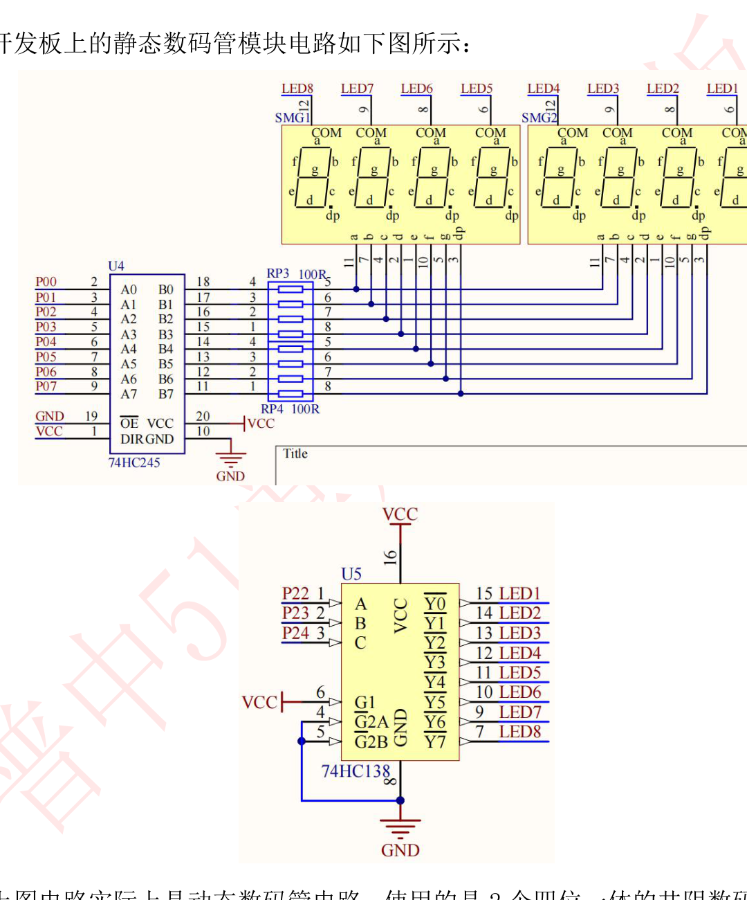

# 课程笔记｜51单片机｜静态数码管实验（实验6）

## 课程信息

| 项目 | 内容 |
|---|---|
| 日期 | 2026-09-27 |
| 课程/章节 | 普中51开发攻略 第11章（静态数码管实验） |
| 使用材料 | 攻略 PDF 第11章；6-静态数码管实验/main.c |
| 整理范围 | 完整（数码管原理 → 段码表 → 硬件 → 源码 → 动手） |

## 一、核心结论

1. 数码管是**8 段 LED**（a~g + dp 小数点），共阴/共阳指公共端接法；开发板用的是**共阴**（公共端接低，某段给高即亮）。 [教材 攻略 p.130]
2. **段码表是"查表"的经典应用**：0x3F 表示显示"0"（a~f 亮、g/dp 灭），数组下标=要显示的数字。[教材 攻略 p.133]
3. 段选数据走 **P0 → 74HC245**（驱动增强）；位选由 **P2.2/P2.3/P2.4 → 74HC138**（3-8 译码器）控制。[教材 攻略 p.136]
4. 位选默认状态：P2 全高 → 74HC138 的 **Y7 有效** → 选中**最左边数码管 SMG1**，所以实验现象是 SMG1 显示"0"。 [教材 攻略 p.136]
5. "静态" = 一位数码管**常亮显示**，赋一次段码值即可，无需刷新（对比下章的"动态"）。[教材 攻略 p.137]

## 二、知识结构

```mermaid
flowchart LR
    A[要显示的数字] --> B[段码表查表 gsmg_code[n]]
    B --> C[P0 输出段码]
    C --> D[74HC245 增强驱动]
    D --> E[数码管段选 a~dp]
    F[P2.2/2.3/2.4 默认111] --> G[74HC138 译码]
    G --> H[Y7 有效选中 SMG1]
    E --> I[SMG1 显示数字]
```

## 三、详细笔记

### 3.1 认识数码管

数码管内部是 8 个 LED：7 段（a、b、c、d、e、f、g）+ 1 个小数点（dp）。共用一个公共端：

| 类型 | 公共端接法 | 某段怎么亮 |
|---|---|---|
| 共阴 | 公共端接 GND | 该段给**高电平**亮 |
| 共阳 | 公共端接 VCC | 该段给**低电平**亮 |

> 开发板是**共阴**，段选给 1 亮、给 0 灭。位选（公共端）由 74HC138 选通，低电平选中。

### 3.2 段码表是怎么来的（自己也能推）

显示"0"：a、b、c、d、e、f 亮，g、dp 灭。段位顺序（常见定义）`dp g f e d c b a`，共阴亮=1：

```
dp g f e d c b a
 0 0 1 1 1 1 1 1   = 0x3F
```

| 显示 | 段码(共阴) | 显示 | 段码(共阴) |
|---|---|---|---|
| 0 | 0x3F | 8 | 0x7F |
| 1 | 0x06 | 9 | 0x6F |
| 2 | 0x5B | A | 0x77 |
| 3 | 0x4F | B | 0x7C |
| 4 | 0x66 | C | 0x39 |
| 5 | 0x6D | D | 0x5E |
| 6 | 0x7D | E | 0x79 |
| 7 | 0x07 | F | 0x71 |

> 用法：`gsmg_code[5]` = 0x6D = 显示"5"。数组下标就是你要显示的数字，这就是**查表**。[教材 攻略 p.133]

### 3.3 硬件电路：P0 段选 + 74HC138 位选

开发板上没有单独的静态数码管，用的是动态数码管电路的**其中一位**（SMG1 最左）：



*图：数码管模块电路 —— 74HC245(U4) 驱动段选、RP3/RP4 上拉排阻、74HC138(U5) 位选、SMG1/SMG2 两个四位一体共阴数码管*

**74HC245（八路收发器）**：P0 输出电流能力不足，经它增强后驱动段选线 a~dp；P0 外接上拉排阻 RP3/RP4。
**74HC138（3-8 译码器）**：输入 A0/A1/A2（接 P2.2/P2.3/P2.4）3 位二进制，译码出 Y0~Y7 中一个低电平，共阴数码管位选低电平有效。[教材 攻略 p.136]

### 3.4 为什么不用写位选代码

`main()` 里只写段码，没写位选：

```c
SMG_A_DP_PORT=gsmg_code[0];   // 把"0"的段码 0x3F 送到 P0 → SMG1 显示 0
```

因为单片机**复位后 P2 默认全 1**：P2.4P2.3P2.2 = 111 → 74HC138 选 Y7 → SMG1（最左）被选中。所以想显示在哪位，默认就在 SMG1；要换位才需要写位选（下章动态数码管会用到）。

### 3.5 源码逐行解读

```c
#include "reg52.h"                  // 头文件
typedef unsigned int u16;           // 别名：u16
typedef unsigned char u8;           // 别名：u8
#define SMG_A_DP_PORT P0            // 宏：段码端口命名为 SMG_A_DP_PORT

u8 gsmg_code[17]={0x3f,0x06,0x5b,0x4f,0x66,0x6d,0x7d,0x07,
                  0x7f,0x6f,0x77,0x7c,0x39,0x5e,0x79,0x71};
// 共阴段码表：下标 0~15 对应显示 0~F（第 17 个元素留着备用）

void main()
{
    SMG_A_DP_PORT=gsmg_code[0];     // 查表：把"0"的段码送到 P0 → 显示 0
    while(1)
    {
        // 静态显示：一次赋值后数码管常亮，主循环空转即可
    }
}
```

> 因为共阴数码管显示一次后**持续发光**（LED 保持），不需要反复刷新，所以 while(1) 里什么都不用做。

### 3.6 我的实现：把段码表"写成能看懂的样子"

> 📁 本人工程：`桌面\普中51单片机\Keil project\数码管\静态数码管显示\main.c`（代码日期：2026-07-15，署名 freedom）

逻辑和官方一致，改动集中在**可读性和工程规范**上：

| 维度 | 官方 `6-静态数码管实验` | 你的实现 |
|:--|:--|:--|
| 段码表 | `gsmg_code[17]`，16 个值排成两行 | `gsmg_code[16]`，**每个段码独占一行并注明点亮哪几段** |
| 头注释 | 厂商模板 | 作者 / 日期署名 |
| 尾注释 | 无 | 硬件连接说明（74HC245 / 74HC138 / P2 复用 / 跳线帽） |
| 显示内容 | `gsmg_code[0]` 显示 0 | `gsmg_code[10]` 显示 A |
| 头文件 | `"reg52.h"` | `<REGX52.H>` |

最有价值的是段码表这一改：

```c
u8 gsmg_code[16] = {
    0x3f, // 0 -> a b c d e f
    0x06, // 1 -> b c
    0x5b, // 2 -> a b d e g
    ...
    0x71  // F -> a e f g
};
```

官方版是 16 个十六进制数挤在两行里，想搞清"`0x5b` 为什么是 2"得自己拆二进制。你**把每一段的点亮情况直接写在旁边**——这一步把"背段码表"变成了"看懂段码表"，正好呼应 3.2 节的推导方法。

顺带一提：官方声明 `[17]` 却只填 16 个初值（第 17 个自动补 0），你用 `[16]` 刚好放下 16 个字符，更严谨。

**需要留意（一处可以更精确的说法）**：

你尾注释里写「P2.2~P2.5 与 LED D3~D6 复用」。这 4 根线确实都接在 LED 上，但**它们在数码管里的角色要拆开看**：

| 引脚 | 接到哪 | 和数码管的关系 |
|:--|:--|:--|
| P2.2 / P2.3 / P2.4 | 74HC138 的地址线 A0/A1/A2 | **位选就是这三根**（3-8 译码器，3 根足够） |
| P2.5 | 蜂鸣器（同时也是 LED D6） | **不参与位选**，但扫描时绝不能被误改，否则蜂鸣器会响 |

也就是说：**位选只占三根线**，不是四根。这个区别在静态显示里看不出来（P2 默认全 1 就选中了 SMG1），但到了动态扫描、要用整字节给 P2 赋值时就很关键——你在动态数码管里用 `P2 & 0xE3` 正好避开了 P2.5，见 [[动态数码管#3.5 我的实现：用定时器中断重构扫描（本实验的最大升级）|动态数码管 §3.5]]。

## 四、例题、案例或实验

**动手任务：改显示内容**

1. 打开 `E:\学习资料\4--实验程序\1--基础实验\6-静态数码管实验` 工程
2. 把 `gsmg_code[0]` 改成 `gsmg_code[2]` → 编译烧录 → 显示"2"
3. 改成 `gsmg_code[10]` → 显示"A"（验证查表下标就是数字）
4. 挑战：想让 SMG1 显示"8"（所有段都亮），应该写哪个下标？
5. 挑战 2：在段码表里加一个自定义段码（如显示"-"= 0x40），显示它

**预期现象**：下载程序后"数码管模块"SMG1（最左边）显示数字 0。[教材 攻略 p.136]

## 五、术语、公式或关键表达

- **段选**：控制显示哪几段（a~dp）
- **位选**：控制选通哪一位数码管（公共端）
- **共阴/共阳**：公共端接 GND/VCC
- **74HC245**：八路驱动/收发器，增强 P0 驱动能力
- **74HC138**：3-8 译码器，3 位输入选 8 路输出
- **查表法**：数组+下标取段码
- **段码**：一个字节，每一位对应一段

## 六、课堂任务与 DDL

- 完成第四节动手任务 1~3 并记录现象（无硬性截止日期）
- 挑战项：自定义段码显示"-"或"E"

## 七、待核对与疑问

| 问题 | 原因 | 相关来源 | 建议核对方式 |
|---|---|---|---|
| 74HC138 输入 A0/A1/A2 与 P2.2/2.3/2.4 的对应关系 | 影响后续动态数码管位选编程 | 攻略 p.136 简略 | 对照原理图逐个核对 |
| 为什么 Y7 对应 SMG1（最左） | 取决于 PCB 布线 | 攻略 p.136 | 板子上实测：改位选看哪位亮 |
| gsmg_code 为什么是 17 个元素 | 16 个够用，官方留了余量 | 源码 | 忽略第 17 个即可 |
| P2.5 的确切用途（蜂鸣器？还是 74HC138 使能？） | 本人注释写"P2.2~P2.5 复用"，但 74HC138 只需 3 根地址线 | 本人工程尾注释 vs 攻略 p.136 | 对照 `E:\学习资料\2--开发板原理图` 确认 |

## 八、复习与主动回忆

### 10–20 分钟复习清单

1. 复述共阴/共阳区别与开发板类型
2. 默写"0、1、8"的段码（共阴）
3. 说出 74HC245 和 74HC138 各负责什么
4. 解释为什么静态数码管不需要刷新

### 主动回忆题

1. 共阴数码管显示"1"，段码为什么是 0x06（0000 0110）？
2. 为什么 P0 输出要经过 74HC245 才能接数码管？
3. 想让 SMG1 显示"0"，位选为什么不用写代码？
4. `SMG_A_DP_PORT=gsmg_code[5]` 显示什么？
5. 段码表如果写成共阳的（0xC0 等），放在共阴板上会怎样？

### 答案要点

1. 显示"1"亮 b、c 两段：bit1、bit2=1 → 0000 0110 = 0x06。[教材 攻略 p.133]
2. P0 输出电流/驱动能力不足以直接带数码管段，74HC245 增强驱动（同蜂鸣器的 ULN2003 思路）。[教材 攻略 p.136]
3. 复位后 P2 默认全 1，74HC138 自动选中 Y7 → SMG1；段选只管显示内容。[教材 攻略 p.136]
4. 显示"5"（gsmg_code[5]=0x6D）。
5. 共阳段码在共阴板上会"反相显示"（该亮的灭、该灭的亮），显示乱码。

---
*素材来源：《普中51单片机开发攻略_V1.3》第11章；E:\学习资料\4--实验程序\1--基础实验\6-静态数码管实验\main.c。*
